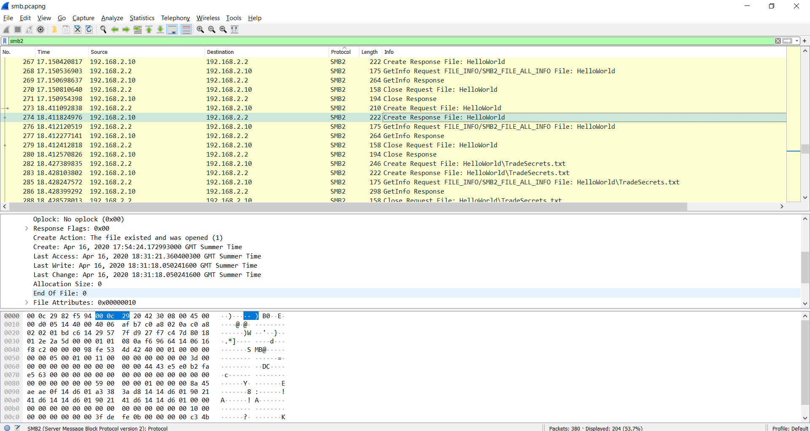

# Yellow brick road (50) - UNSLOVED
`File smb.pcapng What is the path of the file that is opened?`

While I am not too sure about where to go with this challange, Ill start by looking at `SMB2`, we can see that there are a fair few requests to create a file called `HelloWorld` and then some about `HelloWorld\TradeSecrets.txt` :
