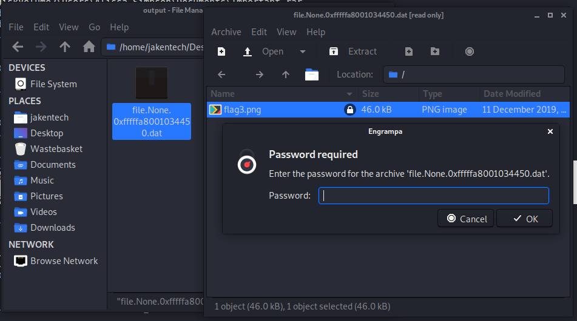
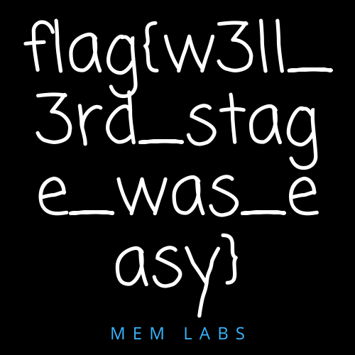
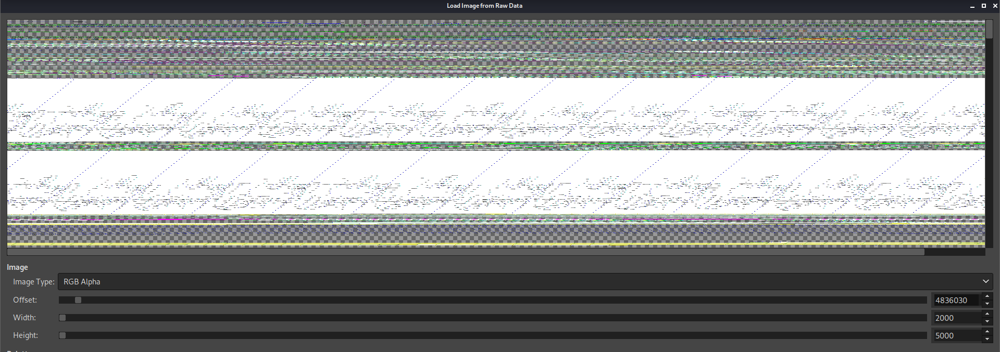

# MemLabs Lab 1 - Beginner's Luck
`My sister's computer crashed. We were very fortunate to recover this memory dump. Your job is get all her important files from the system. From what we remember, we suddenly saw a black window pop up with some thing being executed. When the crash happened, she was trying to draw something. Thats all we remember from the time of crash. Note: This challenge is composed of 3 flags.`

### Flag 1
After downloading the file and running image info we can have a look at pslist and see a number of intresting processes:
```
Volatility Foundation Volatility Framework 2.6
Offset(V)          Name                    PID   PPID   Thds     Hnds   Sess  Wow64 Start                          Exit                          
------------------ -------------------- ------ ------ ------ -------- ------ ------ ------------------------------ ------------------------------
0xfffffa8001dfa910 dwm.exe                1988    852      5       72      1      0 2019-12-11 14:32:25 UTC+0000                                 
0xfffffa8002222780 cmd.exe                1984    604      1       21      1      0 2019-12-11 14:34:54 UTC+0000                                 
0xfffffa80022bab30 mspaint.exe            2424    604      6      128      1      0 2019-12-11 14:35:14 UTC+0000                                 
0xfffffa8000f4db30 dwm.exe                3004    852      5       72      2      0 2019-12-11 14:37:14 UTC+0000                                 
0xfffffa8001010b30 WinRAR.exe             1512   2504      6      207      2      0 2019-12-11 14:37:23 UTC+0000                                 
0xfffffa8001048060 DumpIt.exe              796    604      2       45      1      1 2019-12-11 14:37:54 UTC+0000                                 
0xfffffa800104a780 conhost.exe            2260    368      2       50      1      0 2019-12-11 14:37:54 UTC+0000 
```
After a bit of seraching it turns out dwm is Windows desktop manegment so we can discount this, from the description we know that `where trying to draw something` so this explains `mspaint.exe`; `WinRAR.exe` and the `cmd.exe` are intresting though. So to look at the CMD history we run:
```
$ sudo volatility -f MemoryDump_Lab1.raw --profile=Win7SP1x64 cmdscan
Volatility Foundation Volatility Framework 2.6
**************************************************
CommandProcess: conhost.exe Pid: 2692
CommandHistory: 0x1fe9c0 Application: cmd.exe Flags: Allocated, Reset
CommandCount: 1 LastAdded: 0 LastDisplayed: 0
FirstCommand: 0 CommandCountMax: 50
ProcessHandle: 0x60
Cmd #0 @ 0x1de3c0: St4G3$1
Cmd #15 @ 0x1c0158: 
Cmd #16 @ 0x1fdb30: 
```
But this doesnt't help, althought what was entered is intresting! Insted we can run:
```
$ sudo volatility -f MemoryDump_Lab1.raw --profile=Win7SP1x64 consoles
Volatility Foundation Volatility Framework 2.6
**************************************************
ConsoleProcess: conhost.exe Pid: 2692
Console: 0xff756200 CommandHistorySize: 50
HistoryBufferCount: 1 HistoryBufferMax: 4
OriginalTitle: %SystemRoot%\system32\cmd.exe
Title: C:\Windows\system32\cmd.exe - St4G3$1
AttachedProcess: cmd.exe Pid: 1984 Handle: 0x60
----
CommandHistory: 0x1fe9c0 Application: cmd.exe Flags: Allocated, Reset
CommandCount: 1 LastAdded: 0 LastDisplayed: 0
FirstCommand: 0 CommandCountMax: 50
ProcessHandle: 0x60
Cmd #0 at 0x1de3c0: St4G3$1
----
Screen 0x1e0f70 X:80 Y:300
Dump:
Microsoft Windows [Version 6.1.7601]                                            
Copyright (c) 2009 Microsoft Corporation.  All rights reserved.                 
                                                                                
C:\Users\SmartNet>St4G3$1                                                       
ZmxhZ3t0aDFzXzFzX3RoM18xc3Rfc3Q0ZzMhIX0=                                        
Press any key to continue . . .                       
```
And there base64 is returned when the odd looking text is entered; chuckign the base64 into CyberChef gives us the first flag, `flag{th1s_1s_th3_1st_st4g3!!}` 

### Flag 2
For the second flag we are going to deal with `WinRAR.exe`, if we run `cmdline` we can see that:
```
WinRAR.exe pid:   1512
Command line : "C:\Program Files\WinRAR\WinRAR.exe" "C:\Users\Alissa Simpson\Documents\Important.rar"
```
So we know the name of the file that WinRAR was accessing, so we can now run `filescan` and pass the output into `grep "Important"` to find the file:
```
$ volatility -f MemoryDump_Lab1.raw --profile=Win7SP1x64 filescan | grep "Important"
Volatility Foundation Volatility Framework 2.6
0x000000003fa3ebc0      1      0 R--r-- \Device\HarddiskVolume2\Users\Alissa Simpson\Documents\Important.rar
0x000000003fac3bc0      1      0 R--r-- \Device\HarddiskVolume2\Users\Alissa Simpson\Documents\Important.rar
0x000000003fb48bc0      1      0 R--r-- \Device\HarddiskVolume2\Users\Alissa Simpson\Documents\Important.rar
```
The chances that all three of thease files being diffrent are very low, so for this it doesn't matter which one we can just chose any of them to pull out:
```
$ volatility -f MemoryDump_Lab1.raw --profile=Win7SP1x64 dumpfiles -Q 0x000000003fb48bc0 --dump-dir output/
Volatility Foundation Volatility Framework 2.6
DataSectionObject 0x3fb48bc0   None   \Device\HarddiskVolume2\Users\Alissa Simpson\Documents\Important.rar
```
We then move to open the file but...oh no! It's password protected:

Running strings aginsted the image file (while proberbly not the smartet idea ever) didn't show anythign of intrest. One line of thought is what if the user used the same password for the zip file as thair user account, so we run `hashdump` against the image and:
```
$ volatility -f MemoryDump_Lab1.raw --profile=Win7SP1x64 hashdump
Volatility Foundation Volatility Framework 2.6
Administrator:500:aad3b435b51404eeaad3b435b51404ee:31d6cfe0d16ae931b73c59d7e0c089c0:::
Guest:501:aad3b435b51404eeaad3b435b51404ee:31d6cfe0d16ae931b73c59d7e0c089c0:::
SmartNet:1001:aad3b435b51404eeaad3b435b51404ee:4943abb39473a6f32c11301f4987e7e0:::
HomeGroupUser$:1002:aad3b435b51404eeaad3b435b51404ee:f0fc3d257814e08fea06e63c5762ebd5:::
Alissa Simpson:1003:aad3b435b51404eeaad3b435b51404ee:f4ff64c8baac57d22f22edc681055ba6:::
```
The most user like...user is Alissa Simpson, hashdump is in the format: `User:UID:LM_Hash:NT_Hash` here the LM_Hash is the hash for a blank password, on all the users; when it comes to the NT_Hash we could try to guess it using JohnTheRipper or HashCat or we could google it to see if it has any results, but googling the exact hash shows only other peoples writeups, but https://hashes.org/ 
```
f4ff64c8baac57d22f22edc681055ba6:goodmorningindia
```
However trying the password doesn't get us anywhere, trying the password hash doesn't work either but capitalising the hash works as the password:
```
F4FF64C8BAAC57D22F22EDC681055BA6
```


### Flag 3
The last part of the challange is the MS Paint drawing, from doing a quick bit reaserch paint works with raw images so we need to dump the process that paint was runnning in:
```
$ volatility -f MemoryDump_Lab1.raw --profile=Win7SP1x64 -p 2424 memdump --dump-dir mem
Volatility Foundation Volatility Framework 2.6
************************************************************************
Writing mspaint.exe [  2424] to 2424.dmp
```
Change the extention `.data` and opening in GIMP it opens the `Load image from RAW data` we change the RGB mode to `RGB Alpha` and increase the size of the "area" (I suppose?) and start messing arround with the offset slider to see if we can find anything, we find something intresting at offset 4836030


doing alot of fine tuning with the settings:

It looks a bit like a flag, we clearly need to rotate/flip this image:
