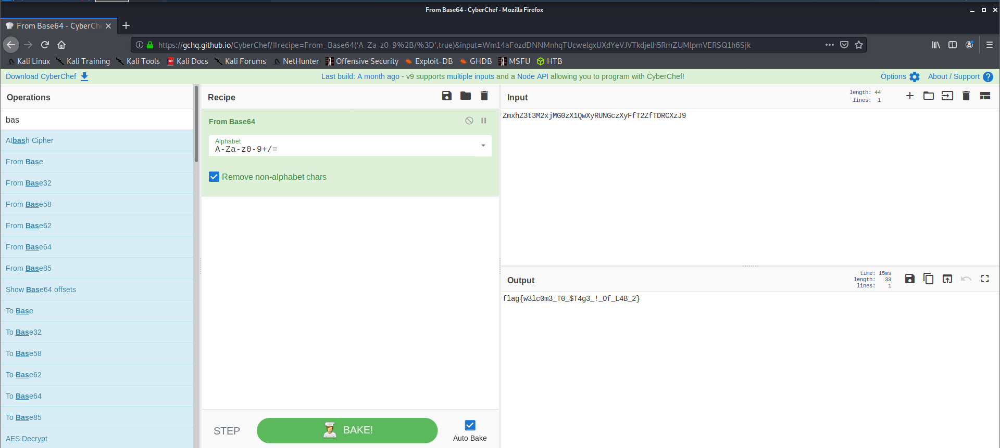
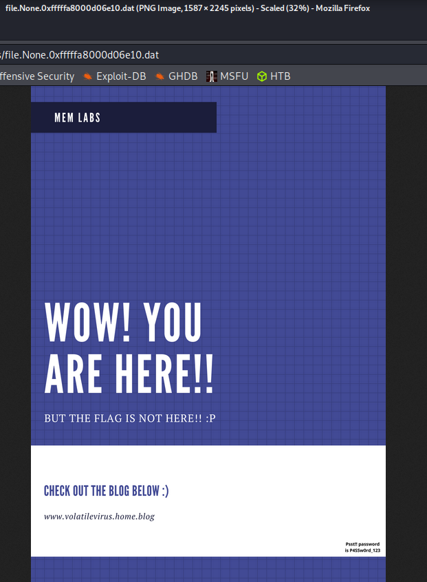
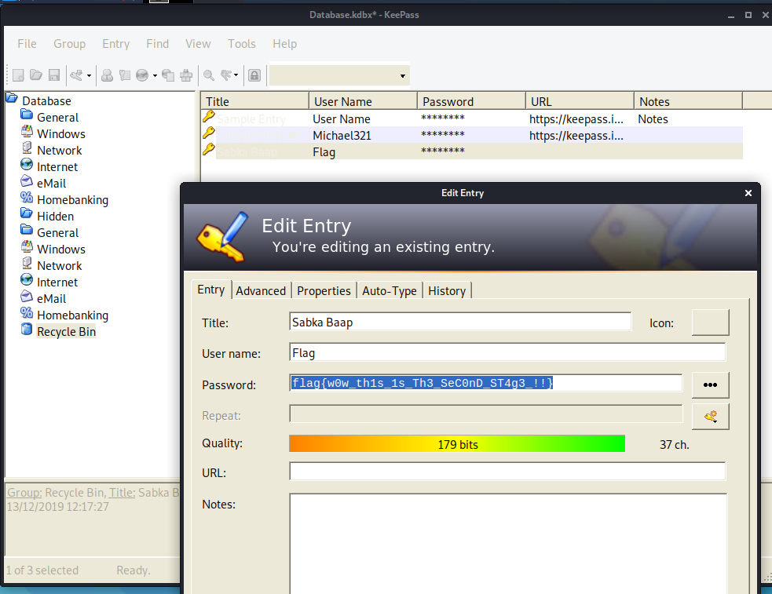
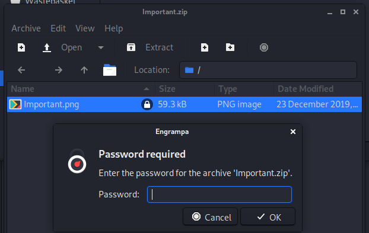

# MemLabs Lab 2 - A New World
`One of the clients of our company, lost the access to his system due to an unknown error. He is supposedly a very popular "environmental" activist. As a part of the investigation, he told us that his go to applications are browsers, his password managers etc. We hope that you can dig into this memory dump and find his important stuff and give it back to us.`

### Flag 1
The first thing to do is gather a profile, once again its Win7SP1x64, and running `pslist` we can see that:
```
$ volatility -f MemoryDump_Lab2.raw --profile=Win7SP1x64 pslist
Volatility Foundation Volatility Framework 2.6
Offset(V)          Name                    PID   PPID   Thds     Hnds   Sess  Wow64 Start                          Exit                          
------------------ -------------------- ------ ------ ------ -------- ------ ------ ------------------------------ ------------------------------
0xfffffa8000ca0040 System                    4      0     80      541 ------      0 2019-12-14 10:35:21 UTC+0000                                 
0xfffffa80022e5950 cmd.exe                2096   2664      1       19      2      0 2019-12-14 10:36:35 UTC+0000                                 
0xfffffa8002109b30 chrome.exe             2296   2664     27      658      2      0 2019-12-14 10:36:45 UTC+0000                                 
0xfffffa8001cc7a90 chrome.exe             2304   2296      8       71      2      0 2019-12-14 10:36:45 UTC+0000                                 
0xfffffa8000eea7a0 chrome.exe             2476   2296      2       55      2      0 2019-12-14 10:36:46 UTC+0000                                 
0xfffffa8000ea2b30 chrome.exe             2964   2296     13      295      2      0 2019-12-14 10:36:47 UTC+0000                                 
0xfffffa8000fae6a0 chrome.exe             2572   2296      8      177      2      0 2019-12-14 10:36:56 UTC+0000                                 
0xfffffa800105c060 WmiPrvSE.exe           2636    588     12      293      0      0 2019-12-14 10:37:02 UTC+0000                                 
0xfffffa800100c060 WmiApSrv.exe           2004    484      6      115      0      0 2019-12-14 10:37:05 UTC+0000                                 
0xfffffa800230eb30 chrome.exe             1632   2296     14      219      2      0 2019-12-14 10:37:12 UTC+0000                                 
0xfffffa800101e640 dllhost.exe            2376    588      9      250      1      0 2019-12-14 10:37:40 UTC+0000                                 
0xfffffa800224a8c0 KeePass.exe            3008   1064     12      316      1      0 2019-12-14 10:37:56 UTC+0000                                 
0xfffffa8002230b30 sppsvc.exe             2764    484      5      151      0      0 2019-12-14 10:38:00 UTC+0000                                 
0xfffffa80010f44a0 wmpnetwk.exe            928    484     18      523      0      0 2019-12-14 10:38:03 UTC+0000                                 
0xfffffa80011956a0 notepad.exe            3260   3180      1       61      1      0 2019-12-14 10:38:20 UTC+0000                                 
0xfffffa8001189b30 WmiPrvSE.exe           4004    588      9  1572864 ------      0 2019-12-14 10:39:00 UTC+0000 
```
There are a fair few intresting things here, CMD, notepad, Chrome and KeePass (I did google `WmiPrvSE.exe` and there where some results to suggest that this is something malicous, although I have my doughts)

Starting by running:
```
$ volatility -f MemoryDump_Lab2.raw --profile=Win7SP1x64 consoles
Volatility Foundation Volatility Framework 2.6
**************************************************
ConsoleProcess: conhost.exe Pid: 2068
Console: 0xff1e6200 CommandHistorySize: 50
HistoryBufferCount: 1 HistoryBufferMax: 4
OriginalTitle: %SystemRoot%\system32\cmd.exe
Title: C:\Windows\system32\cmd.exe
AttachedProcess: cmd.exe Pid: 2096 Handle: 0x60
----
CommandHistory: 0x3deb10 Application: cmd.exe Flags: Allocated, Reset
CommandCount: 1 LastAdded: 0 LastDisplayed: 0
FirstCommand: 0 CommandCountMax: 50
ProcessHandle: 0x60
Cmd #0 at 0x3db330: Nothing here kids :)
----
Screen 0x3c0ff0 X:80 Y:300
Dump:
Microsoft Windows [Version 6.1.7601]                                            
Copyright (c) 2009 Microsoft Corporation.  All rights reserved.                 
                                                                                
C:\Users\SmartNet>Nothing here kids :)                                          
'Nothing' is not recognized as an internal or external command,                 
operable program or batch file.                                                 
                                                                                
C:\Users\SmartNet>                                                              
**************************************************
```
Now this is intresting! This would hint that this is somehting to do with the wording *"enviromental"* this suggests to me that it could be something to do with enviroment variables:
```
$ volatility -f MemoryDump_Lab2.raw --profile=Win7SP1x64 envars
Volatility Foundation Volatility Framework 2.6
Pid      Process              Block              Variable                       Value
-------- -------------------- ------------------ ------------------------------ -----
    2652 dwm.exe              0x0000000000201320 NEW_TMP                        C:\Windows\ZmxhZ3t3M2xjMG0zX1QwXyRUNGczXyFfT2ZfTDRCXzJ9
```
Aside from looking out of place, it also looks like Base64, this is confirmed when we put it into Cyber Chef:


### Flag 2
The next thing I want to tackel is the KeePass aspect, after doing a bit of reserch it might be possible to get the password store out of memory, KeyPass uses `.kdbx` files, and so we can run the file scan command but searching for the `.kdbx` file type:
```
$ volatility -f MemoryDump_Lab2.raw --profile=Win7SP1x64 filescan | grep "kdbx"
Volatility Foundation Volatility Framework 2.6
0x000000003fb112a0     16      0 R--r-- \Device\HarddiskVolume2\Users\SmartNet\Secrets\Hidden.kdbx
```
We need to extract this:
```
$ volatility -f MemoryDump_Lab2.raw --profile=Win7SP1x64 dumpfiles -Q 0x000000003fb112a0 --dump-dir KeePass/
Volatility Foundation Volatility Framework 2.6
DataSectionObject 0x3fb112a0   None   \Device\HarddiskVolume2\Users\SmartNet\Secrets\Hidden.kdbx
```
Once we have extracted the file we can try to open in, althought it's going to want a password:
```
$ kpcli 

KeePass CLI (kpcli) v3.1 is ready for operation.
Type 'help' for a description of available commands.
Type 'help <command>' for details on individual commands.

kpcli:/> open ./file.None.0xfffffa8001593ba0.kdbx
Please provide the master password: *************************
Couldn't load the file ./file.None.0xfffffa8001593ba0.kdbx: Missing pass
kpcli:/>
```
There are a couple of places the password could be, the login password (Which is the same as the one from lab1), the notepad document, the clipboard; somewhere else. Let's start with the clipboard.
There is nothing in the clipboard, so that rules that out, running strings&grep againest the entire memory image for *"password"* doesn't show anything either. Looking though the results for the filescan command though does show that there is a intresting result:
```
0x000000003fce1c70      1      0 R--r-d \Device\HarddiskVolume2\Users\Alissa Simpson\Pictures\Password.png
```
If we extract this file and open it:



Zooming in a bit we can see that the file contains a password `Psst! the password is P4SSw0rd_123` so we can try this on the kdbx file:
```
$ kpcli

KeePass CLI (kpcli) v3.1 is ready for operation.
Type 'help' for a description of available commands.
Type 'help <command>' for details on individual commands.

kpcli:/> open hidden.kdbx 
Please provide the master password: *************************
Couldn't load the file hidden.kdbx: encrypt: datasize not multiple of blocksize (16 bytes) at /usr/share/perl5/File/KeePass.pm line 1047.
kpcli:/> 
```
Trying other varients of the same password suggest either that this is a password for somthing else.
Turning attention back to the notepad document (Which proerbly has nothing to do with the challange) shows that we can't use the `notepad` module with this profile; so we run the dump the process to its own memory file and then run strigns, after looking throught the text (a bit too quickly admitidly) there is only one thing that stands out, a github link: `https://gist.github.com/marcelmaatkamp/119708bebacfc0848b73428275cbe5aa` searching for `github` shows that there are a number of links to diffrent peoples gihub pages, but the one with the link in question is a link to , what would appeare to be, volatiltiy commands relating to the first lab.

After doing a bit more reserch, I started to look into the file Signature to see if it was that that was giving us greif and indeed the file signature was correct, the error message that came up when we entered a password didn't help much either as it didn't explicity say that the password was incorrect. https://keepass.info/help/base/repair.html Looking at this page was helpful as there was a note about opening in recovery mode, so I created my own kdbx file and `File -> Import` , From the file extention in volatiltiy and the magic bytes we know that this is a KeePass KDBX (2.x) file, and we need repair mode so we select this `hidden.kdbx` in recovery mode and open the file, the window was populated with a few more folders and in the recycle bin folder we find the flag:

### Flag 3
The last part to deal with is the Internet aspect, for this we know that the user is likely using Chrome, we need to pull out the history; It's may be possiable that there is a volatiltiy extention for Chrome but we can instead pull the history file out of memory and look at that, there is indeed a history file:
```
$ volatility -f MemoryDump_Lab2.raw --profile=Win7SP1x64 dumpfiles -Q 0x000000003fcfb1d0 -D ./History
Volatility Foundation Volatility Framework 2.6
DataSectionObject 0x3fcfb1d0   None   \Device\HarddiskVolume2\Users\SmartNet\AppData\Local\Google\Chrome\User Data\Default\History
SharedCacheMap 0x3fcfb1d0   None   \Device\HarddiskVolume2\Users\SmartNet\AppData\Local\Google\Chrome\User Data\Default\History
```
Using DB browser to look at the history files (As its just an SQLite file) in the history file, and on the `urls` table there is a link to a MEGA drive share; on this share is a zip file called `Important.zip` downloading this file and trying to open shows it's password protected, so I would guess the password to the Zip file is either in the KeePass file or the password mentioned in the image we found earlier. 


However the password from the image file doesn't work, so from here there are a couple of things that can be done, try to "crack" the zip file. I think the smart thing to do would be to try to get the kdbx file open. 
Now that we have seen inside the KeePass file we know that it doesn't have the flag to the zip file that we need for the last stage, a bit more looking arround lead me to run the volatiltiy command `iehistory` which did turn up a few intresting results but where only for this particular zip. Some more head scratching later and I decided to run binwalk, to make sure it wasn't hiding anything else and well I saw something that helped:
```
$ binwalk Important.zip 

DECIMAL       HEXADECIMAL     DESCRIPTION
--------------------------------------------------------------------------------
0             0x0             Zip archive data, encrypted at least v2.0 to extract, compressed size: 57191, uncompressed size: 59291, name: Important.png
57367         0xE017          End of Zip archive, footer length: 90, comment: "Password is SHA1(stage-3-FLAG) from Lab-1. Password is in lowercase."

```
So we run the commands:
```
$ echo -n "flag{w3ll_3rd_stage_was_easy}" | openssl sha1
(stdin)= 6045dd90029719a039fd2d2ebcca718439dd100a
```
And the zip file gets extracted, glad I didn't try to break into this one!
