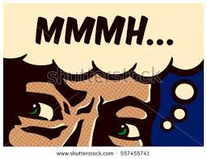

# MemLabs Lab 3 - The Evil's Den

`A malicious script encrypted a very secret piece of information I had on my system. Can you recover the information for me please?
 Note-1: This challenge is composed of only 1 flag. The flag split into 2 parts. Note-2: You'll need the first half of the flag to get the second. `

Sounds intresting! There is also a side note saying that we are going to need steghide, a steganography tool; Very intresting. This time the image is a 32bit version of windows:
```
Suggested Profile(s) : Win7SP1x86_23418, Win7SP0x86, Win7SP1x86_24000, Win7SP1x86
```
As we don't know what build this image is for we will stick with `Win7SP1x86` and adjust if we have issues. Running `pslist` doesn't really show anything intresting other then two notepad files. 
Going back to the challange description we need to be looking for a script and proberbly an image file. Running file scan shows us some intresting files:
```
0x0000000004f34148      2      0 RW---- \Device\HarddiskVolume2\Users\hello\Desktop\suspision1.jpeg
0x000000003e727e50      8      0 -W-rw- \Device\HarddiskVolume2\Users\hello\Desktop\vip.txt
0x000000003de1b5f0      8      0 R--rw- \Device\HarddiskVolume2\Users\hello\Desktop\evilscript.py.py
```
We extract all of thease, I was first drawn to the text file which, once decoded from hex (using xxd) shows:
```
00000000: 616d 3167 6432 5634 4d32 3077 5847 7333  am1gd2V4M20wXGs3
00000010: 6232 553d 0d0a 0000 0000 0000 0000 0000  b2U=............
```
Mostlikely Base64, but decoded in CyberChef shows that this text is ``jm`wex3m0\k7oe`` clealy this isnt anyhing meaningful but this could be a password to the stego we are told about, so turning our attention to the jpeg:



Running stegide, and entering the decoded B64:
```
$ steghide extract -sf sus.jpeg 
Enter passphrase: 
steghide: could not extract any data with that passphrase!
```
Clearly we need to try harder! 

Moving to the python script, and its a very simple one:
```python
import sys
import string

def xor(s):
	a = ''.join(chr(ord(i)^3) for i in s)
	return a
def encoder(x):	
	return x.encode("base64")
if __name__ == "__main__":
	f = open("file.txt", "w")
	arr = sys.argv[1]
	arr = encoder(xor(arr))
	f.write(arr)
	f.close()
```
So we can see that it creates a string, XOR's that string and then base64 encodes it. We simply need to reverse this, XOR needs a key however which we could just brute force in Cyber Chef but we already know the key `.join(chr(ord(i)^3)` 3 is most likely the key so we can try this, and we get:
`inctf{0n3_h4lf` 
So we have the first half of the flag, but what about the rest; it must be in the stego image, but we need the password. Could the password be the first half of the flag:
```
$ steghide extract -sf sus.jpeg 
Enter passphrase: 
wrote extracted data to "secret text".
jakentech@NevilleLongbottomVM:~/Desktop/MemLabs/Lab 3/images$ cat secret\ text 
_1s_n0t_3n0ugh}
```
Indeed it is! So we now have the complete flag!