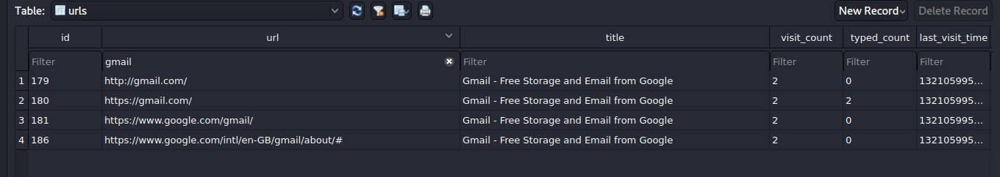
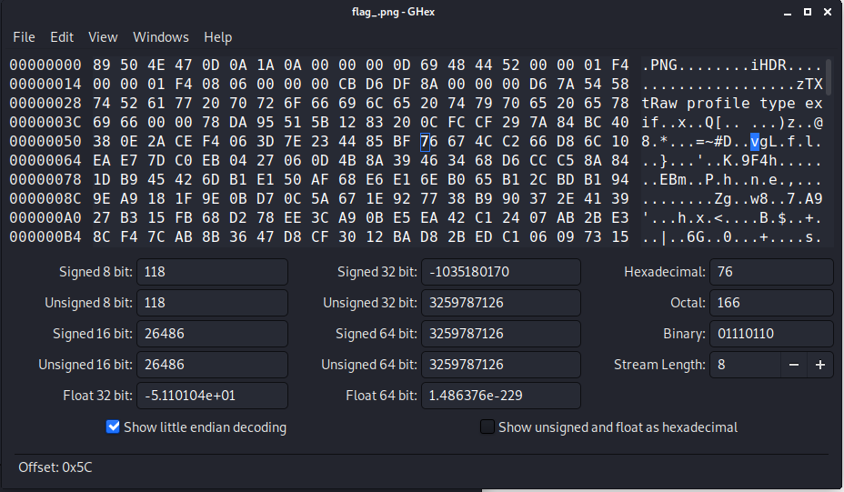

# The Reckoning

`We received this memory dump from the Intelligence Bureau Department. They say this evidence might hold some secrets of the underworld gangster David Benjamin. This memory dump was taken from one of his workers whom the FBI busted earlier this week. Your job is to go through the memory dump and see if you can figure something out. FBI also says that David communicated with his workers via the internet so that might be a good place to start. This challenge is composed of 1 flag split into 2 parts. The flag format for this lab is: **inctf{s0me_l33t_Str1ng}**`

### First half of flag!
We are tolf that there was communication via the internet and that this is a good place to start, but we need to see what browsers we need to look at, running `pslist` :
```
Offset(V)          Name                    PID   PPID   Thds     Hnds   Sess  Wow64 Start                                                   
------------------ -------------------- ------ ------ ------ -------- ------ ------ ------------------------------
0xfffffa800234eb30 chrome.exe             2124   1944     27      662      1      0 2019-08-19 14:40:46 UTC+0000
0xfffffa80021fa630 firefox.exe            2860   2080     11      210      1      1 2019-08-19 14:41:09 UTC+0000  
```
We can also once again see WinRAR so that could be useful to us. But first we need to pull the Chrome and Firefox history files; having a quick look at the result of `iehistory` shows that there are some intresting files accessed from a `Z\:` drive, and a few other intresting files but we can come back to this later.

Trying to extract the firefox history didn't work, we could pull the files out but no matter which set of files we extracted it would not open! SQLite files (as far as I know) can use 3 files, the main sqlite file, `-smh` and `-wal`, as far as I understand they are used in relation to transactions, for ROLLBACK and COMMIT commands. Looking at `iehistory` there is some firefox history displayed in here, it would appeare that this was the browser used to download dump it and that's it, so we may just need to focus on Chrome. 
For chrome we can pull out the `History` file:
```
$ volatility -f MemoryDump_Lab6.raw --profile Win7SP1x64 dumpfiles -Q 0x000000005da5a610 -D ./internet_history/
```
When we look at the `urls` table we can see a whole range of results, form car searches to code related ones. The most intresting off the bat is a link to a pastebin: 
```
https://pastebin.com/RSGSi1hk

https://www.google.com/url?q=https://docs.google.com/document/d/1lptcksPt1l_w7Y29V4o6vkEnHToAPqiCkgNNZfS9rCk/edit?usp%3Dsharing&sa=D&source=hangouts&ust=1566208765722000&usg=AFQjCNHXd6Ck6F22MNQEsxdZo21JayPKug


But David sent the key in mail.

The key is... :(
```
Following the link in the paste sends us to a google doc what would appear to be text from a `Lorem ipsum` genorator. But that URL looks intresting, it says its from a hangouts chat. This could be the method of communication that was mentioned in the breif.
A primative method for testing this theroy is to run `strings MemoryDump_Lab6.raw | grep "hangouts" -i >> hangouts` (I tried not sending it to a file but there where too many results!) looking throught the file there are alot of url's and some stuff that looks like it could be cache; but there is not only no way to get this infomation out of volatility using a tool, and its hard(er) to pull out of the image as its a directory containing files that are made up of other files. The easiest way to find the chat in the hex editor would be to have a hint as to what we might find them talking about but we don't have this. 
Looking back at the history we can see a WhatsApp Web entery, but we are still in the sameboat as we are with hangouts!

So it would appear that we didn't look at the google doc properly...somewhere on page 4 there is a link to a mega drive, when we go to the URL it asks for a decryption key. Looking at the pastebin message again we know the key is `in the mail` going back to the history file we see that there are a fair few enterys for gmail 


This is intresting and somehing I noticed while tooling arround; their is a email address in the image. I would assmume that any chat/gmail messages that are going to be stored on the image are going to be in the browsers cache, which is normally a directory containing files that are made up of other files (its in essence one big text file with an index and when a file is needed from the cache it uses the offset to find it...I think) so this makes extracting it hard, and for us the easiset way is to use strings on the image file and then try searching for diffrent keywords to see if we get anything (Proberbly not the best/most efficent way to solve this but nevermind!)
String searching for `david` does bring up some gmail addresses and two rather intresting results:
```
https://mail.google.com/mail/u/0/#inbox/FMfcgxwDqnhdlrDxfJZXQvHMDdMQkgjtMega Drive Key - davidbenjamin939@gmail.com - Gmailmoc.elgoog.liam.
`Gwx70Kfc6Yxc+
```
So we know we are looking along the right lines, this is most likely the subject line of the email that (hopfully) contains the key; emails use HTML so we can now search using the subject line.
```
Mega Drive Key - davidbenjamin939@gmail.com - Gmail
chrome://passwordmgr/locale/passwordmgr.properties
      <menupopup class="textbox-contextmenu">
```
This particular hit is intresting, but doesn't really help us out; we need to carry on with our search
```
"Mega Drive Key","3":"THE KEY IS zyWxCjCYYSEMA-hZe552qWVXiPwa5TecODbjnsscMIU"
```
THIS IS BIG! This is the key that unlocks the mega file! Downloading the file and trying to open it...well...doesn't work! We need to work out what is wrong with this file for that we can use PNG check:
```
$ pngcheck flag_.png 
flag_.png  first chunk must be IHDR
ERROR: flag_.png
```
Intresting, while I must admit I don't really know what this means it's a start, using a hex editor to open the image we can see why the image isn't opening:



`iHDR` should read `IHDR` correcting this opens the file and gives us the flag. 

### Second half of the flag
From running the files module in Volatiltiy there is an intresting item:
```
0x000000005fcfc4b0     16      0 R--rwd \Device\HarddiskVolume2\Users\Jaffa\Desktop\pr0t3ct3d\flag.rar
```
Natrully we extract this and we get a RAR file thats password protected, the first half of the flag isn't the password (like in some past challages) so we need to try harder! 
Searching for `rar` in our strings file find us the password:
```
RAR password=easypeasyvirus
```
This isn't satifying though...where is the password in the image? Well looking arround this result would suggest that its a enviroment variable:
```
    1868 dwm.exe              0x0000000000371320 RAR password                   easypeasyvirus
```
It shows up a fair bit, but it is indeed the password.
And we get the second half of the flag! 


Amazing range of tasks! Definalty understand volatiltiy alot better now!